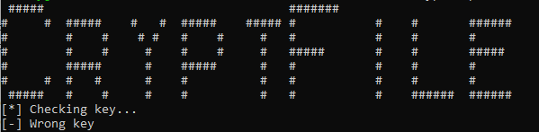
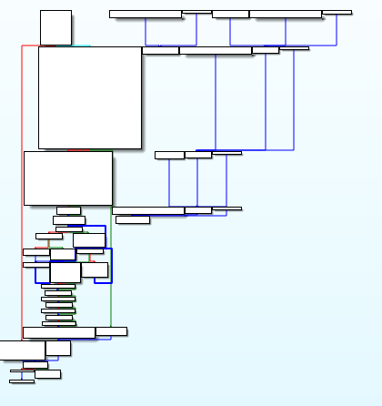
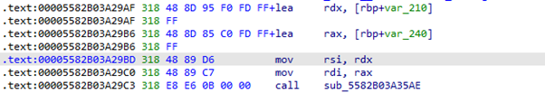
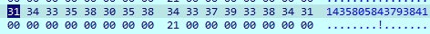
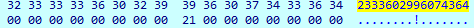
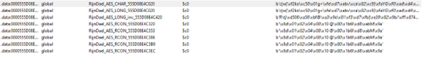
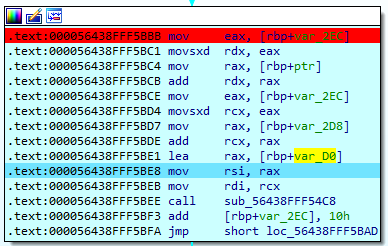
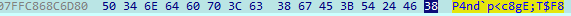
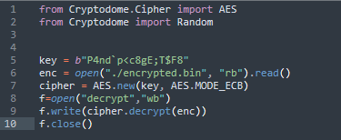

## Phân tích

Đây là một chall thực hiện hiện encrypt file,file thưc hiên encrypt với 2 tham số  là “file key” và không phải key tùy chọn mà là key mặc định. 


 
Load vào IDA ta có flow của chương trình.
 


Mình tìm kiếm chuỗi “wrong key” sau đó trace ngược lên tại hàm sub_55D62DCA75AE() debug thì biết nó thực hiện so sánh 2 chuỗi số nếu đúng thì bắt đầu encrypt file còn không thì hiện lên màn hình “wrong key” như hình bên trên. 

Tiếp tục mình trace theo [rbp+var_240] thì biết input+1483973472739663,sau đó thì tại sub_55D62DCA75AE() so sánh với 4634706992063332.

He he vậy key=3150733519323669
 






 
Bài này tên crypto nên mình thử dùng plugin fincrypto thì biết thực hiện mã hóa file bằng thuật toán mã hóa AES_ECB

 

Mình đặt bp tại 0x56438FFF5BBB debug thì được key là P4nd`p<c8gE;T$F8




 
Vậy bài này mình đã đủ thông tin,để thực giải mã mình sẽ dùng libary của pycryptodome.



Mình load file decrypt vào CFF thì biết đó là 1 file ảnh .png

## FLAG 

```ASCIS{C4yp1o_1s_5impl3_b4t_C++_i5_cr4z9}```
 

