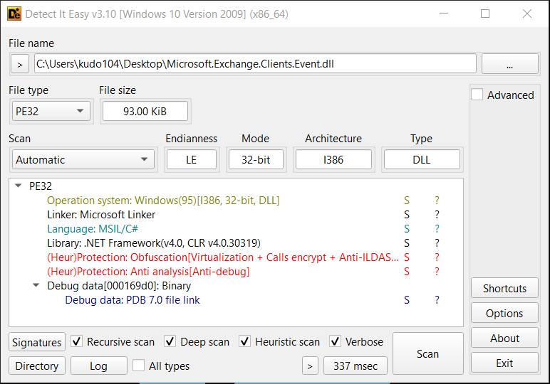
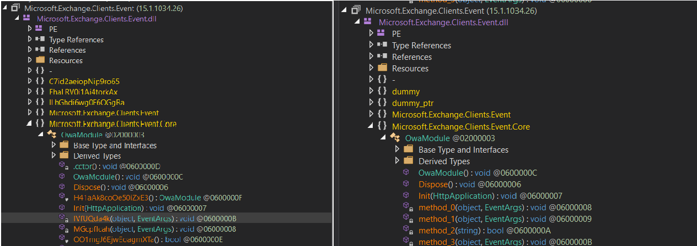
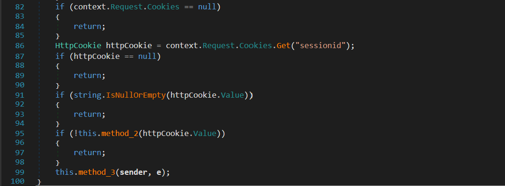

## Overview
We can see that this is a C# file, using .NET Reactor for obfuscation to avoid analysis and detection by antivirus software.



## Unpack
I used .NETReactorSlayer to unpack, and you can see the difference before and after unpacking.



## Analysis 

### Stolen
The malware captures the `username` and `password` at `owa/auth` when login on Mail Exchange. The credentials are stored in C:\windows\temp\~ex.dat, XORed with 183, and then saved in base64 format.


~ex.dat file of the malware stores the following information:
- Timestamp
- Remote IP address
- Username and Password upon login

```
9/6/2024 3:39:01 PM	192.168.204.166	username pasword	Mozilla/5.0 (Windows NT 10.0; Win64; x64) AppleWebKit/537.36 (KHTML, like Gecko) Chrome/122.0.0.0 Safari/537.36	302
```

### Connect

Attacker uses a special sessionid field to connect to the server, allowing them to execute commands and download anything.




## IOCs

> MD5: `A13E534F18967AF816FBE0EF83CC2AB8`

> File: `~ex.dat`