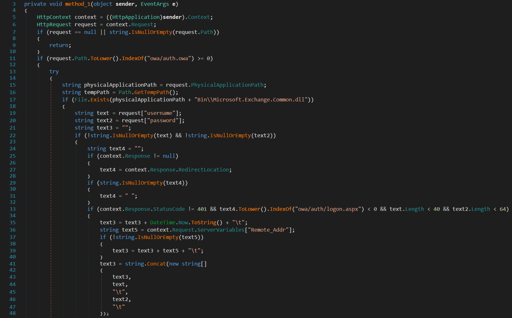

## Tổng quan
Ta có thể nhìn thấy thì đây là một file C#, sử dụng .NET Reactor để obfuscation tránh việc phân tích và phát hiện của AV.


## Unpack
Mình sử dụng .NETReactorSlayer để unpack các bạn có thể thấy sự khác biệt trước và sau khi unpack


## Phân tích 

### stolen
Mã độc thực hiện lấy `username` `password` tại `owa/auth.owa` khi thực hiện đăng nhập trên Mail exchange. Credential được lưu ở `C:\windows\temp\~ex.dat`, `xor 183` và sau đó sẽ thực hiện lưu dưới dạng base64




File ~ex.dat của mã độc lưu các thông tin như sau:
- Thời gian
- Remote ip address 
- Username và Password khi login

```
9/6/2024 3:39:01 PM	192.168.204.166	username pasword	Mozilla/5.0 (Windows NT 10.0; Win64; x64) AppleWebKit/537.36 (KHTML, like Gecko) Chrome/122.0.0.0 Safari/537.36	302
```

### Kết nối

Kẻ tấn công sử dụng trường sessionid dùng để connect đến server có thể thực thi command, download bất kì


## IOCs

> MD5: `A13E534F18967AF816FBE0EF83CC2AB8`

> File: `~ex.dat`