Cobalt Strike được biết đến là framework mô phỏng tấn công với nhiều mô đun và tính năng. Do tính linh hoạt, Cobalt Strike trở nên phổ biến với redteam, cũng như được sử dụng nhiều bởi các nhóm tấn công mạng.

Sau quá trình phân tích một số mẫu, chúng tôi ghi nhận nhiều mẫu mã độc được drop xuống máy nạn nhân nhằm triển khai các beacon Cobalt Strike. Đặc điểm chung là đều thực thi các beacon này trong memory nhằm lẩn tránh sự phát hiện của các tiến trình Antivirus.

Sơ đồ hoạt động:

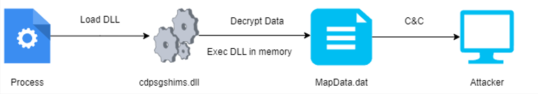

Quá trình xử lý sự cố chúng tôi thu thập được mẫu mã độc có tên cdpsgshims.dll tại thư mục `C:\Windows\System32`, rà soát cùng thư mục cũng phát hiện file MapData.dat có ngày và thời gian tạo tương đồng với file cdpsgshims.dll (Ngoài ra cũng phát hiện file này tại đường dẫn `C:\ProgramData\Microsoft\MapDat`, đây là file cấu hình được sử dụng để DLL gọi tới về sau)

## Phân tích cdpsgshims.dll

File DLL này là PE file 64 bit, có tên gốc là TSVIPSrv.dll. Export một số function, đáng chú ý là function là OfficeClickToRun

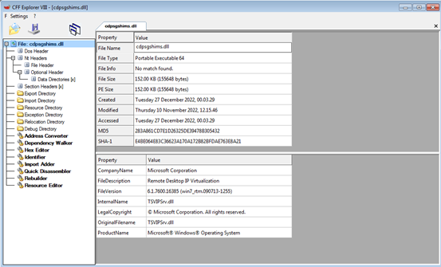

Load DLL và phân tích với IDA, quan sát code tại một số hàm thì nhận thấy một số strings đã bị obfuscated, các chuỗi có thể được giải mã bằng cách xor lần với các giá trị 0x4b,0x43,0x51 (KCQ trong bảng mã ASCII)

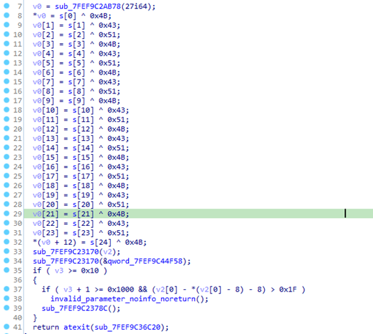

Sau khi giải mã thu được thì được một số strings, trong đó có một số strings có nội dung đặc biệt như CreateRemoteThread và đường dẫn `C:\\\\ProgramData\\\\Microsoft\\\\MapData\\\MapData.dat`

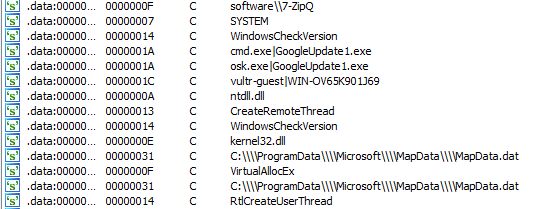

Khi DLL được load, DLL entrypoint sẽ gọi tới hàm export function OfficeClickToRun. Hàm này thực hiện nhiệm vụ cấu thành đường dẫn tới file `MapData.dat` tại đường dẫn `C:\\\\ProgramData\\\\Microsoft\\\\MapData\\\MapData.dat` và đọc nội dung file `MapData.dat`

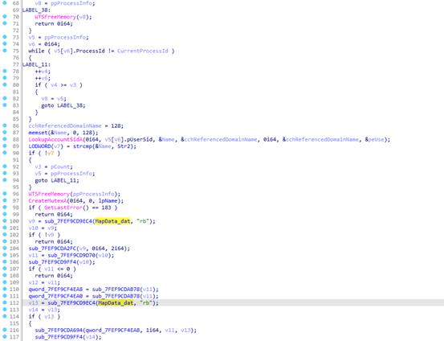

Sau khi đọc file, thực hiện giải mã bằng thuật toán với key là SYSTEM. Sau khi giải mã thành công, payload mới sẽ được gọi sẽ được thực thi

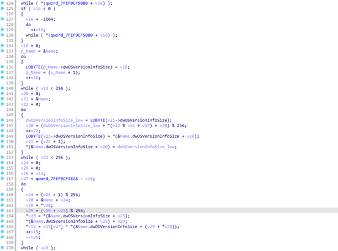

Payload mới là CobaltStrike Beacon HTTPS, đến đây có có thể trích xuất được thông tin cấu hình bằng công cụ CobaltStrikeParser của Sentinel-One hoặc 1768.py của Didier Stevens

## Khôi phục Import Table

Một cách thủ công khác, sau quá trình giải mã RC4, chúng ta có thể thực hiện dump payload mới xuống. Nếu load thử bằng CFF Explorer sẽ không nhận diện được đây là PE file. Lý do là file đã đổi signature `MZ` và `PE` thành `YA` và `IY`

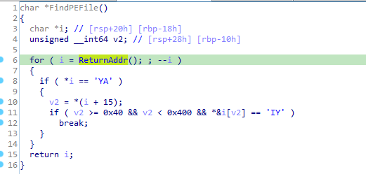

Có thể sửa lại các giá trị trong file từ ‘YA’ thành ‘MZ’ và ‘IY’ thành ‘PE’ bằng các công cụ như HxD hay 010 Editor. Tuy nhiên các thông tin import và các session hầu như đều không còn được nguyên vẹn.

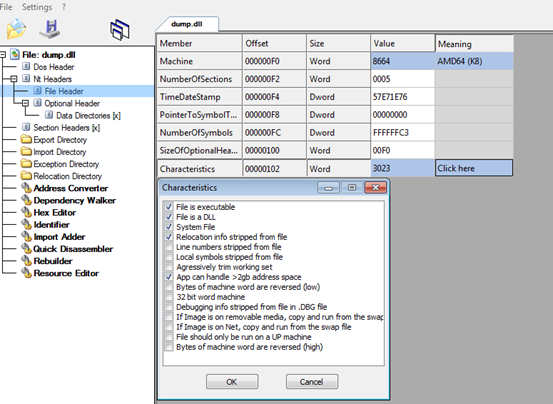

Load file dump.dll vào IDA để phân tích, sau khi giải mã RC4 ở trên hàm export function v3.28 sẽ được gọi tới và thực thi, gần giống với kĩ thuật ReflectiveLoad.

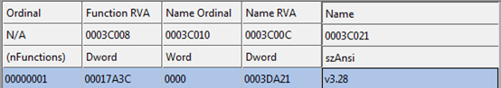

Một chỗ cần lưu ý trong hàm này là nó đọc giá trị NumberOfSybols từ File Header và lưu vào biến key sau đó biến này được sử dụng trong hàm DecryptString.Hàm này có chức năng giải mã các string bảng import table hay là tên các section.

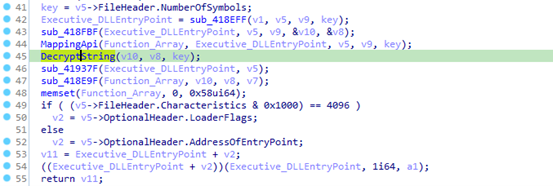

* Hàm export function v3.28 này có nhiệm vụ:
* Tìm data PE file trong dll để load vào vùng nhớ process
* Tìm các Module để load các API
* Giải mã các string trong import table để mapped địa chỉ vào vùng nhớ process
* Cuối cùng là thực thi Dll tại DllEntryPoint

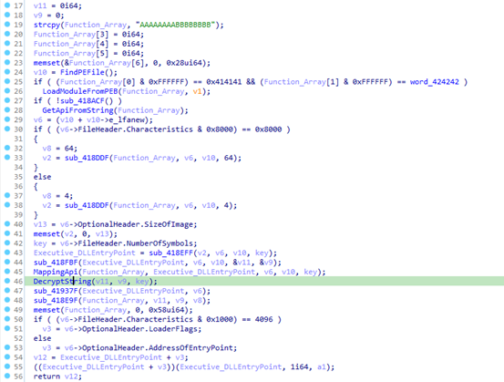

Dựa vào các thông tin trên,có thể khôi phục lại bảng import table.Đây là script để khôi phục lại IAT:

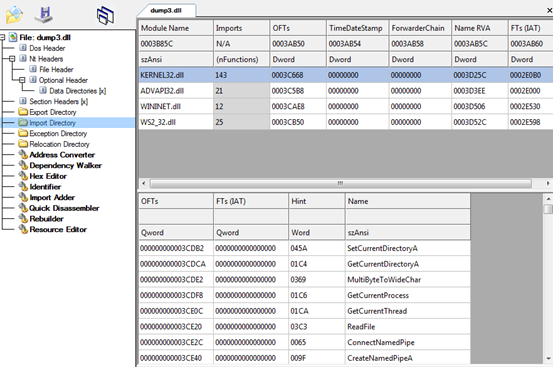

Kết quả sau quá trình khôi phục như sau:

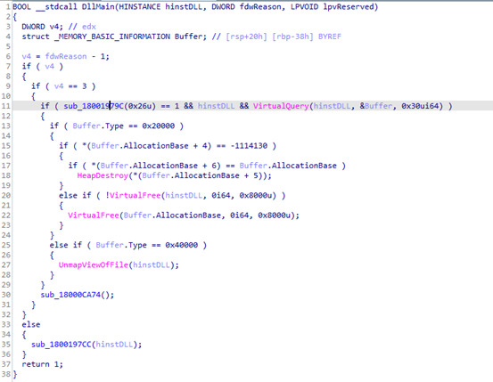

## Indicators of Compromises (IOCs)

> File name:

cdpsgshims.dll    283A861CD7E1D26325DE39478B305432 (MD5)

python23.dll        53F030E658E7D95A2DBB5AC9B99176B6 (MD5)

TmDbgLog.dll      9B12F3471260840953025F2C39B47DCC (MD5)

> File config:

MapData.dat       6F5A07D59D8B637E38DCA7A1575CD229 (MD5)

winnt.config         DD4E176F33F91E27F557A4D67F9B3331 (MD5)

mtxstify.scr           EE4B2DA99308C3E7EA81C4E1F80C946E (MD5)

> C2:

didongbuy.com

news.worldstockhub.com

18.138.81.223