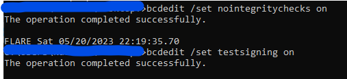
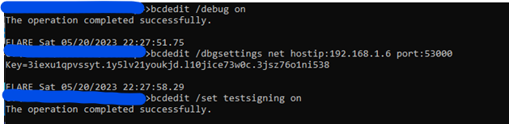
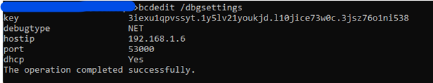
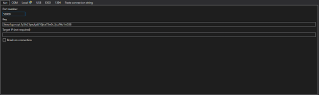
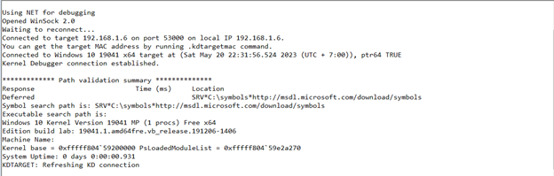
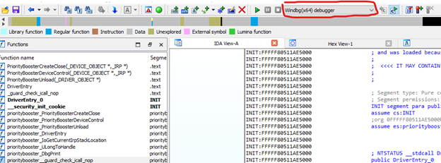
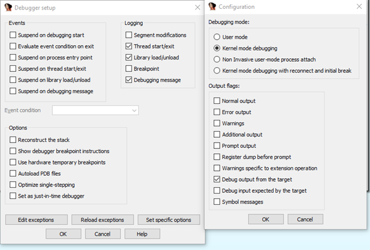
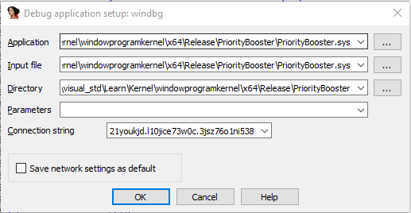
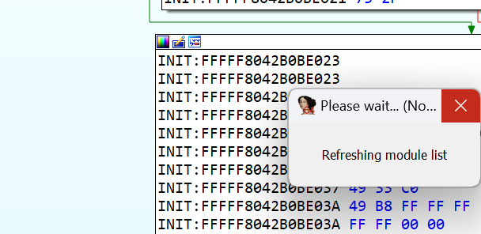
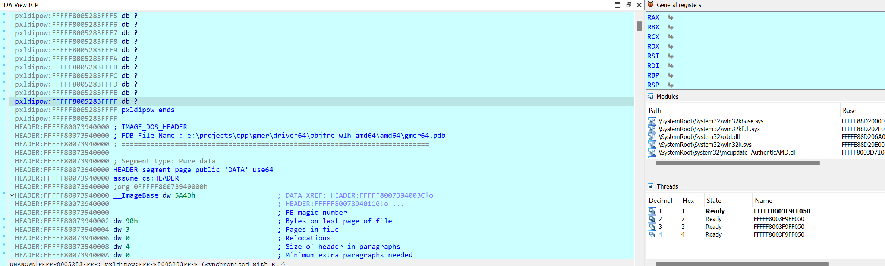

Để debug kernel chúng ta cần 1 máy ảo và 1 máy host để debug. Máy host để debug cần cài Windbg để thực hiện debug

## Máy ảo - 192.168.1.6

Máy ảo mình sử dụng Windows 10 

Việc đầu tiên chúng ta cần làm trên máy ảo để debug là tắt năng check signature của windows để load kernel

```
bcdedit /set nointegritychecks on

bcdedit /set testsigning on
```



Tiếp theo thực hiện các câu lệnh sau để enbale debug. Windbg hổ trợ nhiều loại debug khác nhau như `Net`, `COM`,.. Ở đây mình setup debug thông qua `Net`

```
bcdedit /debug on
bcdedit /dbgsettings net hostip:ip_vmware port:port_des
bcdedit /set testsigning on
```



Tiếp theo thực hiện câu lệnh sau để lưu thông tin như `key`, `hostip`, `port` để debug



## Máy host

Sử dụng `key`, `port` đã lưu ở trên nhập các thông tin trong windbg



Load debug thành công



Sau khi load debug thành công trên windbg tiếp tục settup trên IDA

Chọn Windbg debuger:



Trên thanh menu Debugger->Debug option-> Set specific option -> chọn kernel mode debugging



Chọn Debugger->Process option tại Connection string điền theo format sau:
Net:port=<….>,key=<….>

`net:port=53000,key=3iexu1qpvssyt.1y5lv21youkjd.l10jice73w0c.3jsz76o1ni538 -> OK`



Bây giờ chúng ta chạy và debug thôi ^.^. Đi pha tách coffe ngồi đợi thôi. Nếu mà có hình `Refreshing module list` thì debug thành công đợi nó tải hoàn tất các symbol.



Debug thành công



Lưu ý: Nếu không hiển thị `Refreshing module list` thì từ câu lệnh này`bcdedit /dbgsettings net hostip:ip_vmware port:port_des` ta đổi thành `.\kdnet.exe ip_host port_des` file `kdnet.exe` tại dường dẫn `C:\Program Files (x86)\Windows Kits\10\Debuggers\x64` trên máy machine.