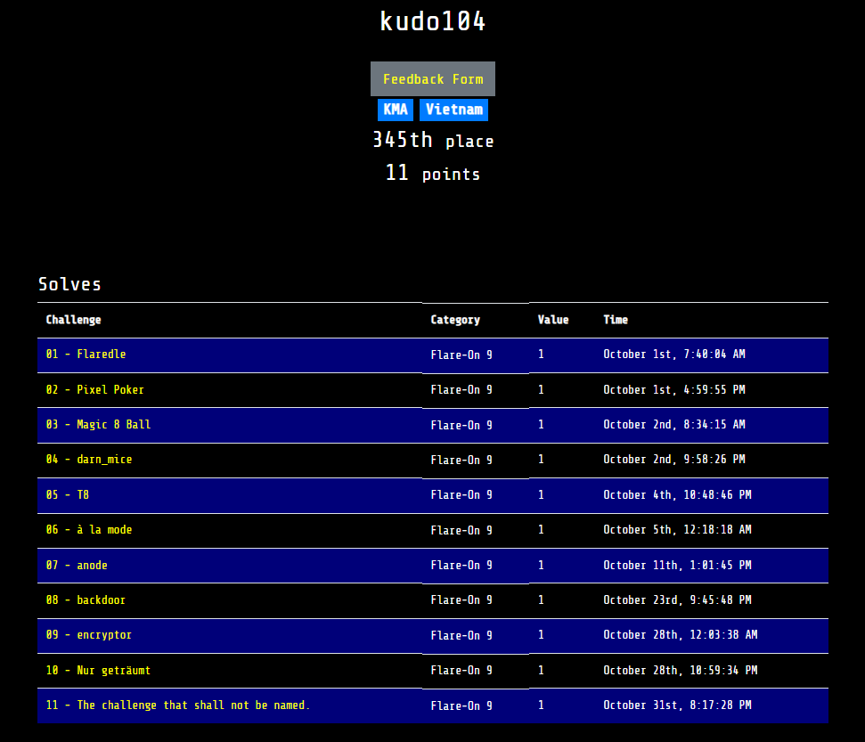
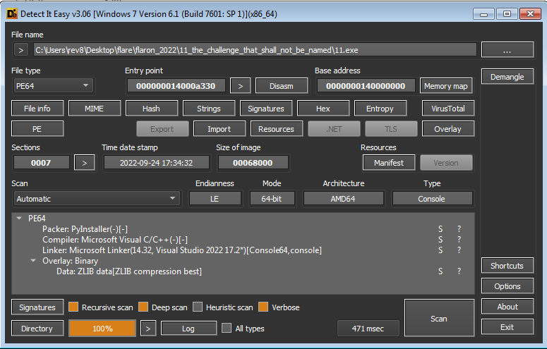
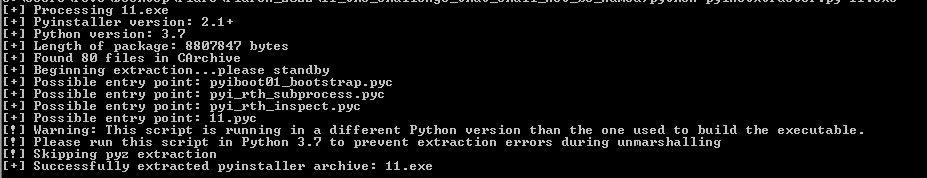
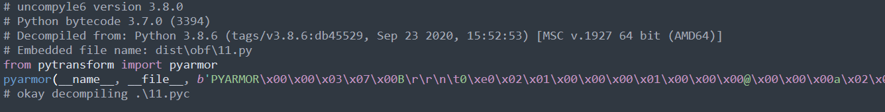
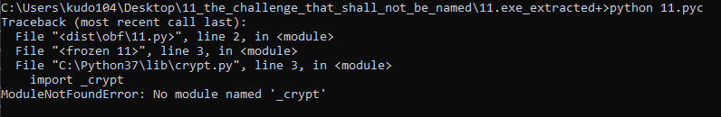
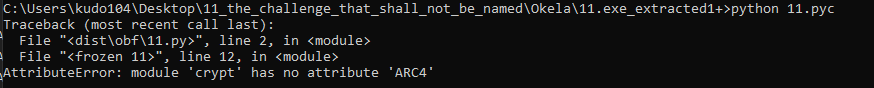

Lời đầu tiên mình muốn nói đó là cảm ơn mấy anh em trong `KCSC` đã giúp đỡ mình rất nhiều để mình clear Flare-on 2022 sau nhiều ngày.



## Tổng Quan 
Đầu tiên mình ném vào `Detect it easy` để có các thông tin cơ bản, chương trình dùng pyinstaller để đóng gói.



## Unpack & Analysis
Sử dụng tool có sẵn `PyInstaller Extractor` để unpack,file cần reverse 11.pyc



Sử dụng ```decpmpile3``` hay ```uncompyle6``` để decompile `pyc` thành `py`.

Sau khi decompile thành file py thì chương trình đã bị `pyamor`

  

Sau khi chạy file 11.py thì biết cần 1 số thư viện khác thử decompile Crypt.pyc tại vì 11.pyc load thèn này đầu tiên nên mình decompile thèn này,thì thấy thư viện này cũng bị pyamor trong khi python là mã nguồn mở và decompile thì những thèn khác không bị.Do đó Crypt.py đã bị custom.

 

Thử tạo 1 file rỗng Crypt.py thì biết được nó dùng ARC4.Chỉ cần tạo 1 class ARC4 và in ra là được flag

 

```
class ARC4:
  def __init__(self, name):
    self.name = name

  def encrypt(self,b):
    print(b)
```

Flag `Pyth0n_Prot3ction_tuRn3d_Up_t0_11@flare-on.com`

