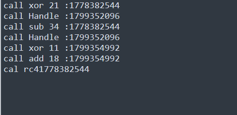

## Frida 

Frida is a dynamic instrumentation tool that allows developers and security researchers to inject JavaScript into running processes on mobile and desktop platforms.

## Hooking a funtion at VA 

when you read this article,i suggest that you should consider reading this article first [here](https://frida.re/docs/functions/).

In the program,there are many funtions we want to hook.How we can find addresses to hook.

You can based on offset after decompile to hooking funtions not defined in GCC,MSVC,..

Here is an example. I want to hook the list of functions below to trace the flow of the program.


You can see table of funtions in IDA.Colum start is the address of function such as 140001DDB,140001AE6,...

My script frida hook.
```
import frida
import sys
# aaaaaaaaaaaaaaaaaaaaaaaaaaaaaaaaaaaaaaaaa
session = frida.attach("fishing.exe")
script = session.create_script("""

Interceptor.attach(ptr("0x7ff6a4b12310"), {
    onEnter(args) {
        console.log("rc4 :"  + hexdump(args[0]));
    }
});

Interceptor.attach(ptr("0x7ff6a4b117D0"), {
    onEnter(args) {
        console.log("sub_1400017D0 :" + hexdump(args[0]));
    }
});

Interceptor.attach(ptr("0x7ff6a4b11CDF"), {
    onEnter(args) {
        console.log("sub_140001CDF :" + hexdump(args[0]));
    }
});

Interceptor.attach(ptr("0x7ff6a4b11D33"), {
    onEnter(args) {
        console.log("sub_140001D33 :" + hexdump(args[0]));
    }
});

Interceptor.attach(ptr("0x7ff6a4b11D87"), {
    onEnter(args) {
        console.log("sub_140001D87 :" + hexdump(args[0]));
    }
});

Interceptor.attach(ptr("0x7ff6a4b11DDB"), {
    onEnter(args) {
        console.log("sub_140001DDB :" + hexdump(args[0]));
    }
});

""")
def on_message(message, data):
    print(message)
script.on('message', on_message)
script.load()
sys.stdin.read()
```

when program loading into process.Windows Loader relies on the PE file structure to load it into the memory.  


Window Load will mapped relies on ImagBase of Nt HEARDER sometimes that memory is used windows loader will choose another imagebase to load the program into the memory process

You can use Process Explorer to see where the program is loaded into memory to fine-tune the position of the functions you want to hook.


You can see that the 'LoadAddress' is 0x7ff6a4b10000, which we need to know in order to fix the script.

Hook is successful, and now we know the flow of the program and how it works.



## Resources
https://www.ired.team/miscellaneous-reversing-forensics/windows-kernel-internals/instrumenting-windows-apis-with-frida

https://fuzzysecurity.com/tutorials/29.html

https://frida.re/docs/functions/