# Tổng quan
Load File vào detect it easy và CFF explore để có cái nhìn tổng quan về mẫu mã  độc sample.exe
* File 32bit 
* Dung lượng 730kb nhưng import table  chỉ sử dụng 1 số api có thể bị packed
## Phân tích tỉnh và phân tích động
Tool sử dụng Ida
1. Phân tích file sample.exe
* Phân tích & rename lại hàm để dễ dàng phân tích:

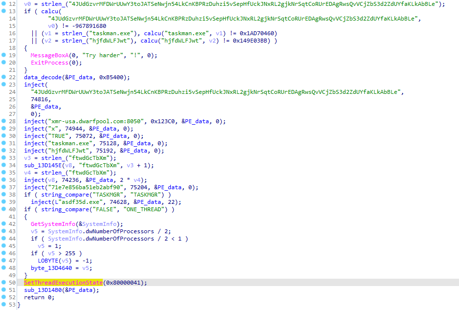

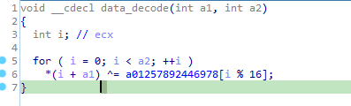
* Dữ liệu mã hóa bằng phép xor khá đơn giản sau khi thử giải mã vài byte đầu thì thấy kí hiệu MZ của cấu trúc PE
* Sử dụng một funtion inject để inject string vào trong câu trúc PE sau khi đã giải mã.Như hình trên thì 
String “xmr-usa.dwarfpool.com:8050” tại vị trí 74688 inject vào PE_data 
> Xử kí & thực thi PE_data

Hàm sub_13D1350

Cấp phát vùng nhớ có quyền thực thi sau đó copy toán bộ PE data vào trong vùng nhớ:
> Hàm sub_13D12C3

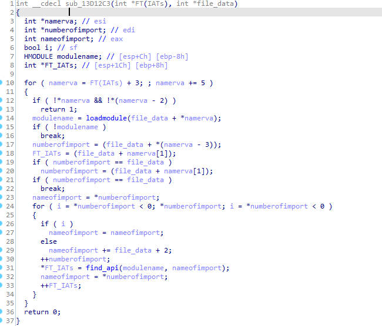

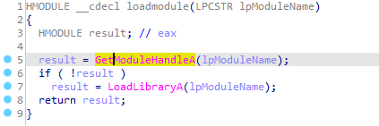

* Hàm này xử lí tìm kiếm địa chỉ IAT của PE_data và sử dụng hàm loadmodule tương ứng để tìm kiếm các địa chỉ tương ứng với các api trong PE_data việc này giống như ánh xạ vào không gian địa chỉ process bằng thủ công thay vì windowloader sẽ có nhiệm vụ này

Thực thi 1 process khác trong sample.exe

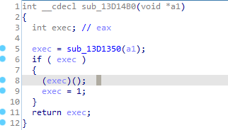

Sau khi tìm kiếm các các địa chỉ api trên các module kernel32.dll,user32.dll,…thì nó sẽ thực thi file tại AddressOfEntryPoint dựa trên câu trúc PE file

Để tiện lợi  cho việc phân tích thì mình sẽ dump dữ liệu ra thì có 2 cách:
* Có thể sử dụng plugin OllDumpEx trong x64dbg để dump
* Dùng idapython

Sau khi dump đặt tên là dump_sample 
## Phân tích file dump_sample

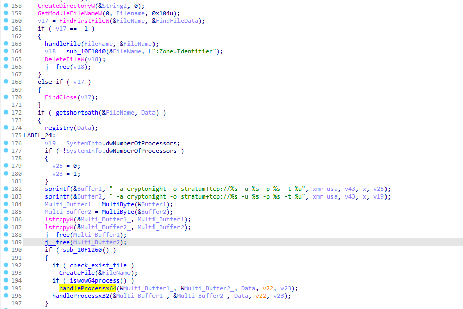

Sử dụng api CreateDirectoryW để tạo folder “C:\Users\user\AppData\Local\hjfdWLFJwt”

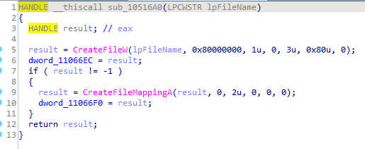

Tại folder mới tạo 1 file executable taskman.exe
>  Hàm registry

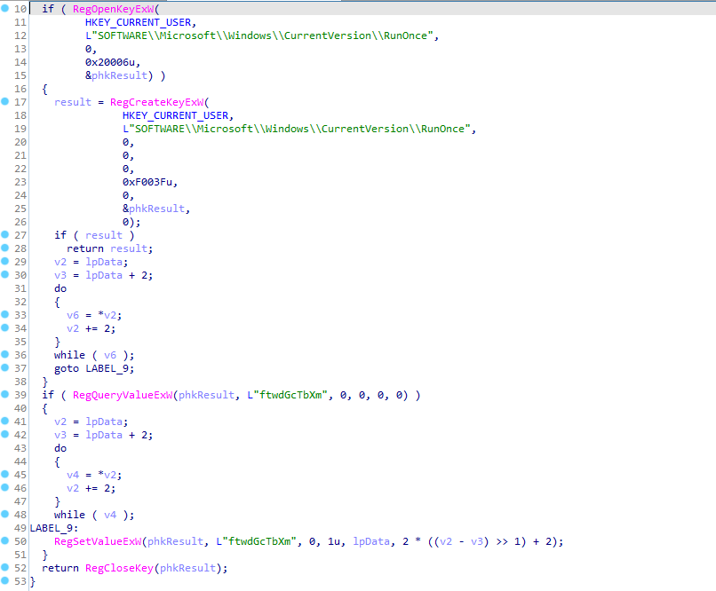

Nếu “SOFTWARE\\Microsoft\\Windows\\CurrentVersion\\RunOnce” đã được tạo thì sẽ thực hiện lấy giá trị tại “ftwdGcTbXm” và ngược lại
## Hàm handleProcessx32
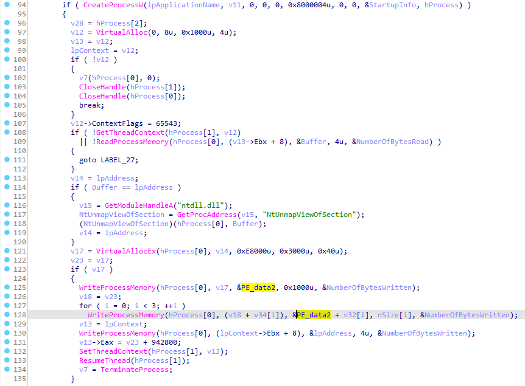

Đoạn đầu khá giống với hàm handleProcessx64 việc tạo ra 1 process notepad với cmd =’ -a cryptonight -o stratum+tcp://xmr-usa.dwarfpool.com:8050 -u 4JUdGzvrMFDWrUUwY3toJATSeNwjn54LkCnKBPRzDuhzi5vSepHfUckJNxRL2gjkNrSqtCoRUrEDAgRwsQvVCjZbS3d2ZdUYfaKLkAbBLe -p x -t 2’

Sau khi hàm này tạo ra process  mới thì viết vào vùng nhớ  của process đó một cấu trúc PE_data sau đó tiếp tục thực thi process

> Dump & phân tích PE_data2

Detect it easy thì File bị packed bằng upx sau khi unpacked upx như hình bên dưới:

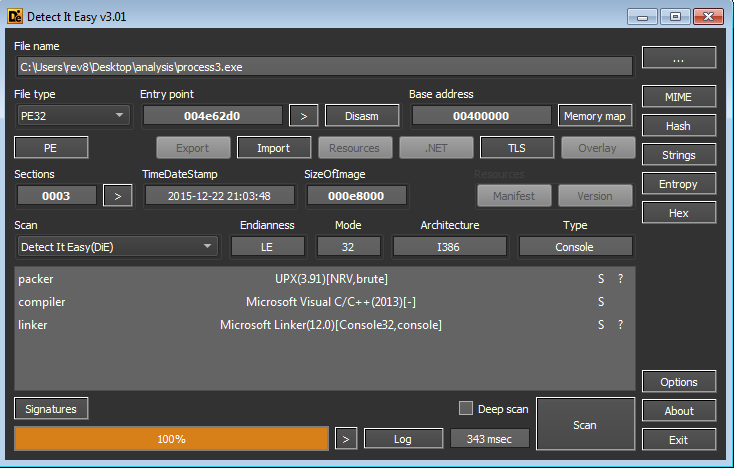

Các option tìm thấy trong hàm handleArg,argv & agrc chính cmd khi tạo với proccess notepad.exe

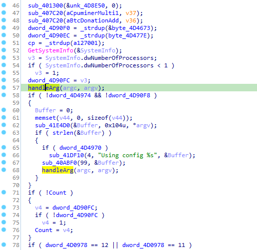

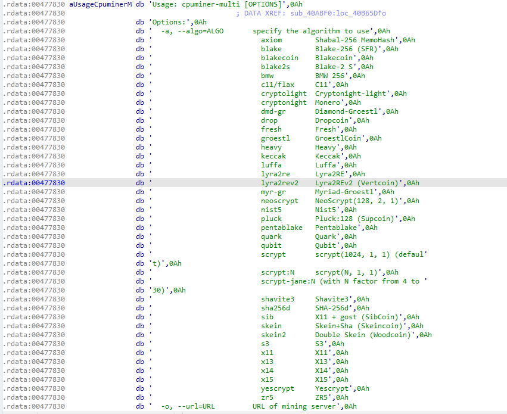

+  -a Specifiy the algorithm to use: Cryptonight
+  - o  URL of mining server:
stratum+tcp://xmr-usa.dwarfpool.com:8050
+ -u username for mining server
+ -p password for mining server
+ -t  number of miner threads (default: number of processors)

Sau khi tra các string option trên google tìm được project (https://github.com/tpruvot/cpuminer-multi) so sánh với Pseudocode trên Ida thì khá giống với project này đây là công cụ sử dụng khai thác crypto
## Hàm handleProcessx64
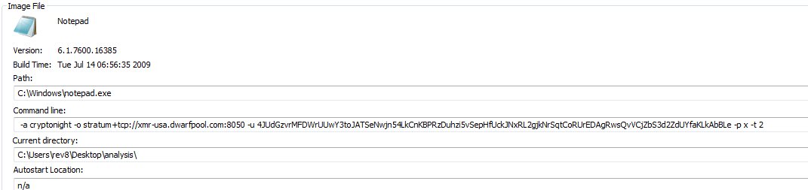

Tạo process notepad.exe với cmd = ‘ -a cryptonight -o stratum+tcp://xmr-usa.dwarfpool.com:8050 -u4JUdGzvrMFDWrUUwY3toJATSeNwjn54LkCnKBPRzDuhzi5vSepHfUckJNxRL2gjkNrSqtCoRUrEDAgRwsQvVCjZbS3d2ZdUYfaKLkAbBLe -p x -t 2

 Sau khi tạo process thì dùng api NtWriteVirtualMemory nó tương tự như WriteProcessMemory cũng có cấu trúc PE được viết vào vùng nhớ process

 > Dump & phân tích processx64

Detect it easy thì File bị packed bằng upx sau khi unpacked upx như hình bên dưới:

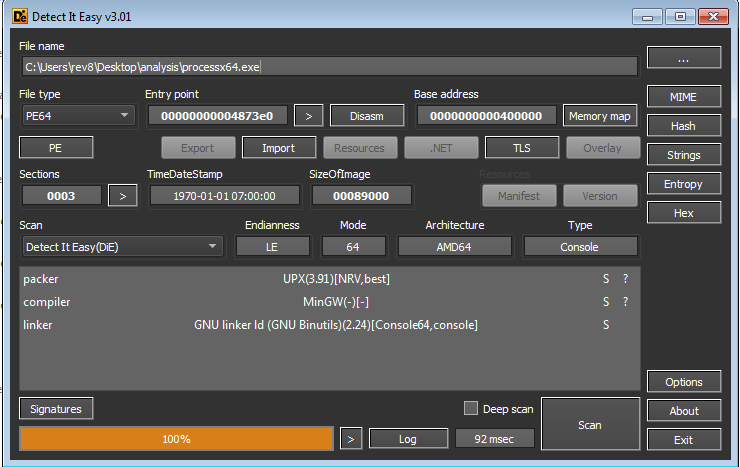

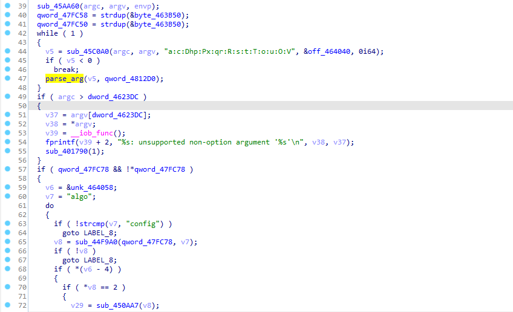

Các option tìm thấy trong hàm parse_arg,argv & agrc tương tự như handleProcessx32

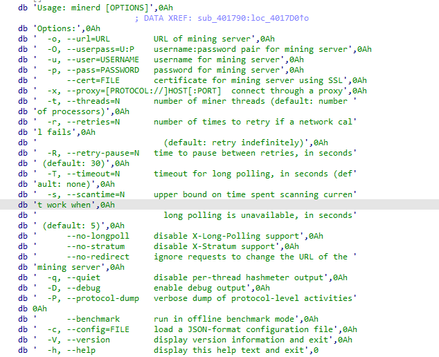

# Tổng kết
* Mã độc sinh ra proccess notepad nhằm mục đích ẩn đi chương trình khai thác crypto
* Các kĩ thuật đặc biệt sử dụng
Anti-reverse:upx,anti-diassembly,ịnject string
* Mục đích chính của mã độc thực hiện khai thác crypto 