## Phân tích
Chạy file Namep.exe 

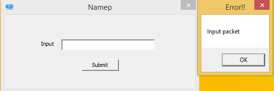

Load file  vào CFF explorer để biết được file có resource,mình thấy không có định đạng nên chắc đã bị encode.
 
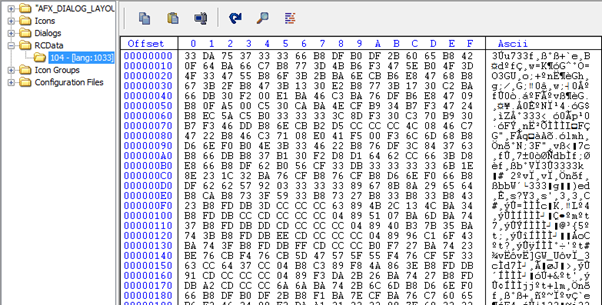

Load file vào IDA.

Sau một lúc phân tích thì biết file này load resource sau đó decode resource và thực thi cái resource.

Việc decode thực hiện phép xor mặc định với 0x33 
 
 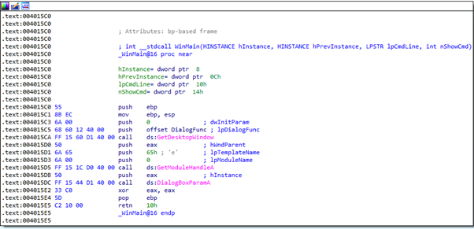

 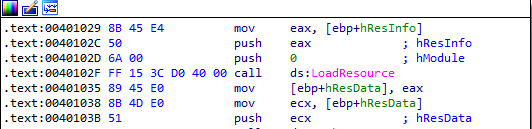

 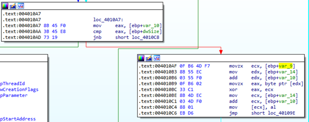
 

Sau khi mình decode resource thì vẫn không biết đây là gì xin hint từ ông anh mới biết đây là một shellcode.
 
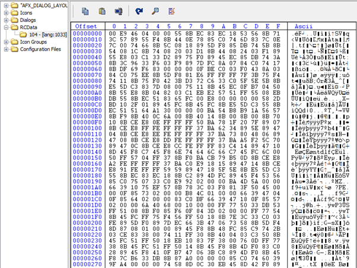

Mình run shellcode thì biết nó load 1 file gì đó dump ra và load vào IDA,thì tìm được block này hehe file cần tìm đây rồi.

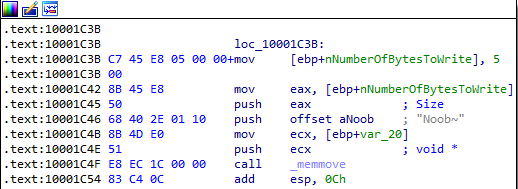

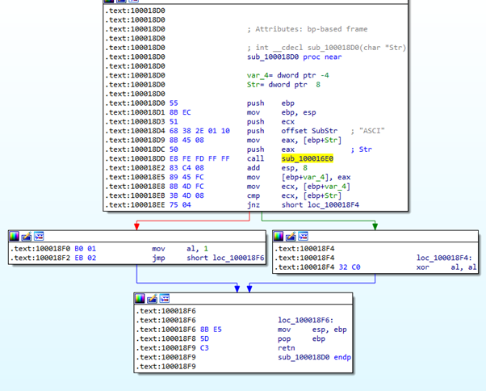

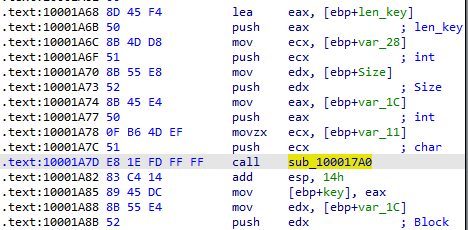

Mình trace ngược lên trên thì biết flag có chuỗi con ASCI nếu không có thì in ra thông báo “Noob~” và ngược lại.

Tiếp tục trace lên trên thì flag được decode bằng mã hóa rc4,mình biết được chuỗi đầu ra nhưng không biết key bao nhiêu byte tiếp tục trace thì key được trả về tại hàm sub_100017A0().Sau một lúc phân tích thì key chỉ có 4 byte,vậy bài này mình đã đủ thông tin để brute.

 
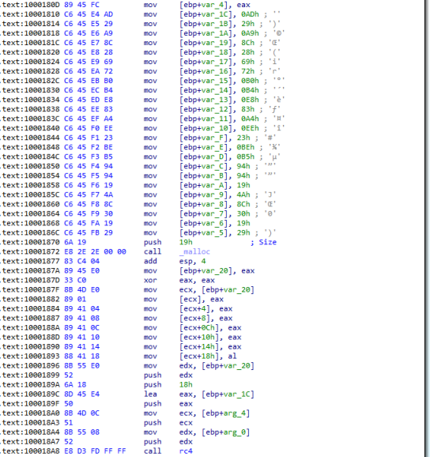

 

Đây là code của mình.
 
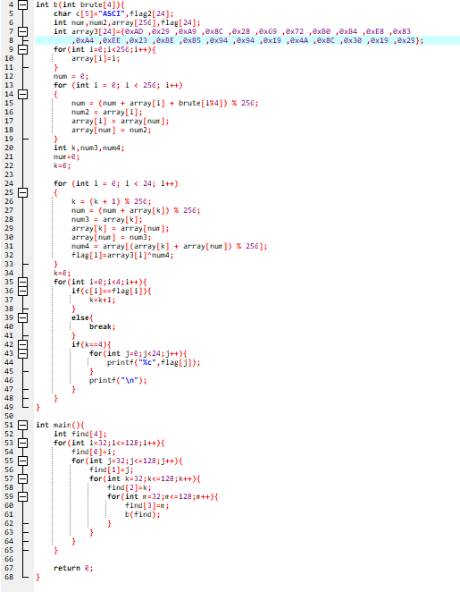 

## FLAG 

```ASCIS{a_s1mpl3_pr0toco1}```


